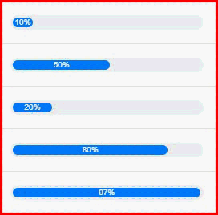
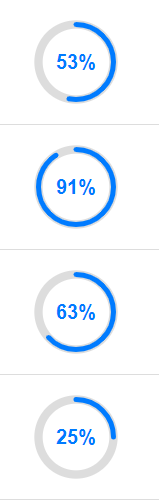

# angular-progress-bar-sm
Stylish animated progress bar
<br/>

<table>
  <tr>
    <td align="center">
      
    </td>
    <td align="center">
      
    </td>
   </tr>
</table>

## Installation

```sh
npm i angular-progress-bar-sm
```

## Usage

## Import
```ts
import { AngularProgressBarSmModule } from 'angular-progress-bar-sm';
```

## Fundamental Usage
```html
<app-progress-bar 
    [progressValue]="50" 
    [progressColor]="'#000'" 
    [progressBarType]="bar"
/>
```

## Fundamentals / Mandatories

| Property/Method       |  Type   | Description                                                             |
| ----------------------| :-----: | ---------------------------------------------------------------------------------- |
| progressValue         | number  | Percentage of filled progress bar                                                  |
| progressBarColor      | string  | Provide color single inverted comma's with hex color code or by default "#007bff"  |
| progressBarType       | string  | By default: 'bar' or can be 'circle'                                               |


## Future Plans
- [ ] Animated filled portion of progress bar.

## Author
Suraj Motwani - Email: suraj.motwani1306@gmail.com

## License

Angular Progress Bar SM is available under the MIT license. See the LICENSE file for more info.

